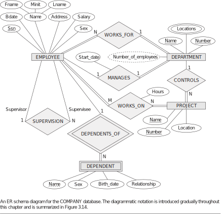

# Company Database from Fundamentals of Database Systems book
This repository contains MySQL dumpfile, SQLite file of **COMPANY** database used in ***Fundamentals of Database Systems book***

## Book Details
[ **Fundamentals of Database Systems** ](https://www.pearson.com/us/higher-education/program/Elmasri-Fundamentals-of-Database-Systems-7th-Edition/PGM189052.html)  
**Authors**: Ramez Elmasri; Shamkant B. Navathe  
**Publisher**: Pearson  
**ISBN-10**: 0133970779  
**ISBN-13**: 9780133970777  

## Relational schema
**EMPLOYEE** (fname, minit, lname, ssn, bdate, address, sex, salary, superssn, dno)  
**DEPARTMENT** (dname, dnumber, mgr_ssn, mgr_start_date)  
**DEPT_LOCATIONS** (dnumber, dlocation)  
**PROJECT** (pname, pnumber, plocation, dnum)  
**WORKS_ON** (essn, pno, hours)  
**DEPENDENT** (essn, dependent_name, sex, bdate, relationship)  

# E-R Diageam

## Tables:
**COMPANY**

| fname    | minit | lname   | ssn       | bdate      | address                  | sex | salary | super\_ssn | dno |
| -------- | ----- | ------- | --------- | ---------- | ------------------------ | --- | ------ | ---------- | --- |
| John     | B     | Smith   | 123456789 | 1965-01-09 | 731 Fondren, Houston, TX | M   | 30000  | 333445555  | 5   |
| Franklin | T     | Wong    | 333445555 | 1955-12-08 | 638 Voss, Houston, TX    | M   | 40000  | 888665555  | 5   |
| Alicia   | J     | Zelaya  | 999887777 | 1968-01-19 | 3321 Castle, Spring, TX  | F   | 25000  | 987654321  | 4   |
| Jennifer | S     | Wallace | 987654321 | 1941-06-20 | 291 Berry, Bellaire, TX  | F   | 43000  | 888665555  | 4   |
| Ramesh   | K     | Narayan | 666884444 | 1962-09-15 | 975 Fire Oak, Humble, TX | M   | 38000  | 333445555  | 5   |
| Joyce    | A     | English | 453453453 | 1972-07-31 | 5631 Rice, Houston, TX   | F   | 25000  | 333445555  | 5   |
| Ahmad    | V     | Jabbar  | 987987987 | 1969-03-29 | 980 Dallas, Houston, TX  | M   | 25000  | 987654321  | 4   |
| James    | E     | Borg    | 888665555 | 1937-11-10 | 450 Stone, Houston, TX   | M   | 55000  | NULL       | 1   |

**DEPARTMENT**

| dname          | dnumber | mgr\_ssn  | mgr\_start\_date |
| -------------- | ------- | --------- | ---------------- |
| Research       | 5       | 333445555 | 1988-05-22       |
| Administration | 4       | 987654321 | 1995-01-01       |
| Headquarters   | 1       | 888665555 | 1981-06-19       |

**DEPT_LOCATIONS**

| dnumber | dlocation |
| ------- | --------- |
| 1       | Houston   |
| 4       | Stafford  |
| 5       | Bellaire  |
| 5       | Sugarland |
| 5       | Houston   |

**PROJECT**

| pname           | pnumber | plocation | dnum |
| --------------- | ------- | --------- | ---- |
| ProductX        | 1       | Bellaire  | 5    |
| ProductY        | 2       | Sugarland | 5    |
| ProductZ        | 3       | Houston   | 5    |
| Computerization | 10      | Stafford  | 4    |
| Reorganization  | 20      | Houston   | 1    |
| Newbenefits     | 30      | Stafford  | 4    |

**WORKS_ON**

|  essn     | pno | hours |
| --------- | --- | ----- |
| 123456789 | 1   | 32.5  |
| 123456789 | 2   | 7.5   |
| 666884444 | 3   | 40.0  |
| 453453453 | 1   | 20.0  |
| 453453453 | 2   | 20.0  |
| 333445555 | 2   | 10.0  |
| 333445555 | 3   | 10.0  |
| 333445555 | 10  | 10.0  |
| 333445555 | 20  | 10.0  |
| 999887777 | 30  | 30.0  |
| 999887777 | 10  | 10.0  |
| 987987987 | 10  | 35.0  |
| 987987987 | 30  | 5.0   |
| 987654321 | 30  | 20.0  |
| 987654321 | 20  | 15.0  |
| 888665555 | 20  | NULL  |

**DEPENDENT**

|  essn     |  dependent\_name | sex | bdate      | relationship |
| --------- | ---------------- | --- | ---------- | ------------ |
| 333445555 | Alice            | F   | 1986-04-05 | Daughter     |
| 333445555 | Theodore         | M   | 1983-10-25 | Son          |
| 333445555 | Joy              | F   | 1958-05-03 | Spouse       |
| 987654321 | Abner            | M   | 1942-02-28 | Spouse       |
| 123456789 | Michael          | M   | 1988-01-04 | Son          |
| 123456789 | Alice            | F   | 1988-12-30 | Daughter     |
| 123456789 | Elizabeth        | F   | 1967-05-05 | Spouse       |